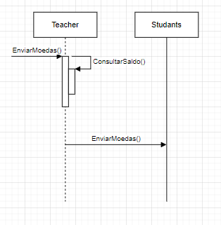
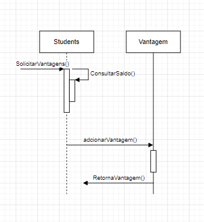

# Diagrama de Sequência
## Professor envia moedas para o Aluno

O diagrama de sequência ilustra a interação entre o professor e o sistema para enviar moedas a um aluno. O professor inicia a ação indicando que deseja enviar moedas e, em seguida, verifica seu saldo disponível. Ele seleciona o aluno destinatário e fornece um motivo obrigatório para o reconhecimento, digitando uma mensagem aberta. O sistema verifica se o saldo do professor é suficiente para a transação. Se o saldo for suficiente, o sistema deduz as moedas. 

## Professor envia moedas para o Aluno

O aluno deve selecionar a vantagem desejada dentre as opções disponíveis. O sistema verifica se o saldo de moedas do aluno é suficiente para realizar a troca pela vantagem escolhida. Se o saldo for suficiente, o aluno confirma a troca da vantagem selecionada. Este passo geralmente envolve a confirmação. Após a confirmação, o sistema deduz automaticamente o número apropriado de moedas do saldo do aluno, refletindo a troca bem-sucedida.

